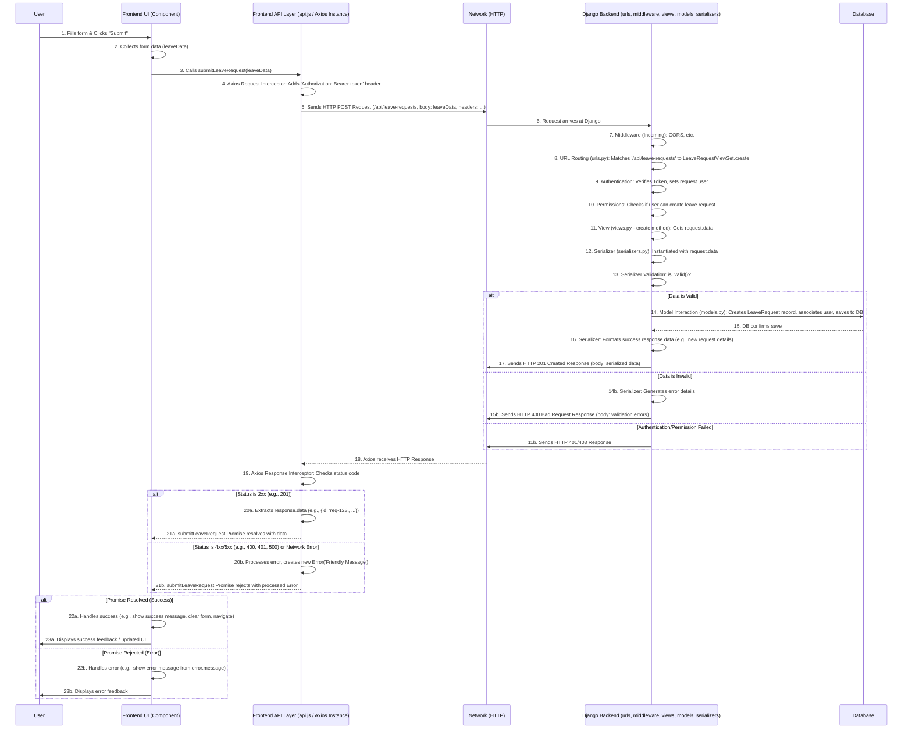

好的，我们来绘制一个表示整个流程的图表，涵盖从前端用户操作到 Django 后端处理再回到前端响应的完整闭环。

考虑到纯文本难以绘制复杂图形，我将使用 **描述性的步骤** 和 **伪代码/标签** 来构建一个流程图的概念，并划分 **前端 (Browser/Axios)** 和 **后端 (Django)** 两个主要区域。

**流程图：前端发起请求 -> Django处理 -> 前端接收响应 (以提交请假为例)**

**流程图文字解释:**

**区域划分:**

*   **Frontend (左侧):** 代表运行在用户浏览器中的代码。
    *   `User`: 最终用户。
    *   `FE_UI`: 前端用户界面层（如 Vue/React 组件），负责展示和接收用户输入。
    *   `FE_API`: 你代码中定义的 API 层 (`api.js`)，使用配置好的 Axios 实例。
*   **Network (中间):** 代表互联网，HTTP 请求和响应的传输通道。
*   **Backend (右侧):** 代表运行在服务器上的 Django 应用。
    *   `Django`: 整个 Django 框架及其组件（URL 路由、中间件、视图、模型、序列化器等）。
    *   `DB`: 数据库。

**流程步骤详解:**

**第一部分：前端发起请求**

1.  **用户操作:** 用户在网页表单中填写请假信息，然后点击“提交”按钮。
2.  **收集数据:** 前端 UI 组件的事件处理函数被触发，它从表单元素中读取用户输入的数据，整合成一个 JavaScript 对象 (`leaveData`)。
3.  **调用 API 函数:** UI 组件调用从 `api.js` 导入的 `submitLeaveRequest` 函数，并将 `leaveData` 作为参数传递。
4.  **请求拦截器:** 在 `submitLeaveRequest` 内部调用 `api.post` 时，Axios **请求拦截器** 自动运行。它从 `localStorage` 获取 `token`，并将其添加到请求的 `Authorization` 头中。
5.  **发送请求:** 配置好的 Axios 实例向后端服务器的 `/api/leave-requests` 地址发送一个 HTTP POST 请求。请求头包含认证信息和 `Content-Type`，请求体包含 JSON 格式的 `leaveData`。

**第二部分：后端处理请求**

6.  **请求到达:** 请求通过网络到达运行 Django 应用的服务器。
7.  **中间件 (入):** 请求首先穿过 Django 配置的入站中间件，例如处理 CORS 跨域头、安全相关的中间件等。
8.  **URL 路由:** Django 的 URL Dispatcher 根据 `urls.py` 中的配置，将 `/api/leave-requests` 这个路径（结合 POST 方法）匹配到相应的视图处理函数（很可能是 DRF `ViewSet` 的 `create` 方法）。
9.  **认证:** Django REST Framework 的认证类运行，检查 `Authorization` 头，验证 token 是否有效，如果有效，则确定用户身份并将其附加到 `request` 对象上 (`request.user`)。如果无效，会提前返回 401 未授权响应 (跳转到步骤 11b)。
10. **权限:** DRF 的权限类运行，检查 `request.user` 是否有权限执行创建请假申请的操作。如果没有，会提前返回 403 禁止访问响应 (跳转到步骤 11b)。
11. **视图逻辑:** 匹配到的视图函数（或方法）开始执行。它通过 `request.data` 访问前端发送过来的 JSON 数据。
12. **序列化器实例化:** 视图创建一个 DRF Serializer 的实例，并将 `request.data` 传递给它，用于数据验证和后续的对象创建。
13. **数据验证:** 调用 Serializer 的 `is_valid()` 方法。Serializer 会根据其定义检查数据的类型、格式、必填项等。
    *   **如果数据有效:** 流程继续到步骤 14。
    *   **如果数据无效:** 流程跳转到步骤 14b。
14. **模型交互 (数据有效时):** 视图使用验证通过的数据，创建一个新的 `LeaveRequest` 模型实例（与数据库表对应），将 `request.user` 关联到申请人字段，然后调用 `.save()` 将记录存入数据库。
15. **数据库确认:** 数据库执行插入操作并确认成功。
16. **序列化响应 (数据有效时):** 视图可能再次使用 Serializer（或者另一个用于输出的 Serializer）将新创建的 `LeaveRequest` 对象转换成 JSON 格式，准备返回给前端。
17. **发送成功响应:** 视图构建一个 HTTP 响应，状态码通常是 `201 Created`，响应体包含序列化后的数据，然后通过 Django 发送回网络。
14b. **生成错误 (数据无效时):** Serializer 的 `errors` 属性包含了详细的验证错误信息。
15b. **发送错误响应 (数据无效时):** 视图构建一个 HTTP 响应，状态码通常是 `400 Bad Request`，响应体包含验证错误信息，然后发送回网络。
11b. **发送认证/权限错误响应:** 如果在步骤 9 或 10 失败，Django/DRF 会直接构建并发送 `401 Unauthorized` 或 `403 Forbidden` 响应。

**第三部分：前端处理响应**

18. **Axios 接收响应:** 前端的 Axios 实例接收到来自服务器的 HTTP 响应。
19. **响应拦截器:** Axios **响应拦截器** 自动运行。它检查响应的状态码。
    *   **如果状态码是 2xx (成功):** 流程进入步骤 20a。
    *   **如果状态码是 4xx 或 5xx (错误)，或者发生网络错误:** 流程进入步骤 20b。
20a. **提取数据 (成功时):** 拦截器提取响应体 `response.data`。
21a. **Promise 解决:** `submitLeaveRequest` 函数返回的 Promise 被**解决 (resolve)**，并将提取出的 `data` 作为结果传递出去。
20b. **处理错误 (失败时):** 拦截器根据错误类型（`error.response.status`, `error.request`, 或其他 `error.message`）生成一个用户友好的错误消息，并创建一个新的 `Error` 对象包含此消息。
21b. **Promise 拒绝:** `submitLeaveRequest` 函数返回的 Promise 被**拒绝 (reject)**，并将处理过的 `Error` 对象作为原因传递出去。
22a. **处理成功:** UI 组件中调用 `submitLeaveRequest` 的 `try` 块（如果使用 `async/await`）或 `.then()` 回调被执行。代码可以根据返回的数据执行后续操作，如显示成功提示、清空表单、跳转页面等。
23a. **更新 UI (成功):** 向用户展示操作成功的反馈。
22b. **处理错误:** UI 组件中的 `catch` 块或 `.catch()` 回调被执行。代码获取到拦截器处理过的错误对象，可以从中读取友好的错误消息 (`error.message`) 并显示给用户。
23b. **更新 UI (失败):** 向用户展示操作失败的错误信息。

这个流程覆盖了从用户界面交互开始，经过前端 API 层、网络传输、后端 Django 应用的完整处理（包括路由、认证、权限、视图逻辑、数据库交互、序列化），再通过网络返回响应，最后由前端 API 层处理并反馈到用户界面的整个过程。